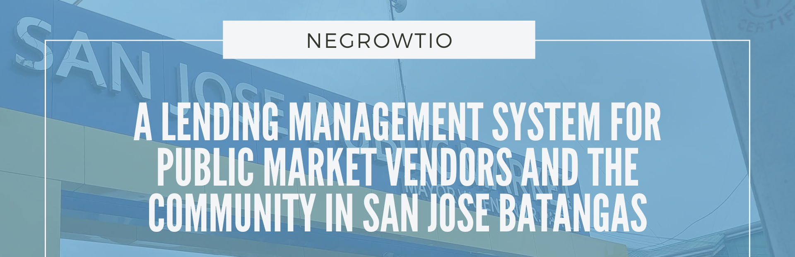

# NeGrowTio: A Lending Management System For Public Market Vendors And The Community In San Jose Batangas

## Overview
NeGrowTio: A Lending Management System For Public Market Vendors And The Community In San Jose Batangas that aims to develop a comprehensive lending management system specifically tailored for public market vendors and the community in San Jose, Batangas. This system will provide efficient and transparent financial services, with a particular focus on the module for calculating financial charges, displaying all information on loan kind variables and any additional loan-related fees to facilitate smooth connection with existing accounting systems.

## Introduction
  Digital infrastructure and technology have become increasingly prominent and essential in a variety of industries. However, many market vendors, including lenders, still don't have access to such resources making it difficult for them to start or grow their businesses. Inadequate or nonexistent internet access, especially in rural locations, is one problem that borrowers frequently encounter. Additionally, it may also be challenging for certain vendors to adopt or use such technologies since they are inexperienced with digital platforms and apps. Due to limited access to digital infrastructure and technology, market vendors and lenders are unable to benefit from these technological advancements.
  
  Traditional business models have been disrupted by the quick development and integration of digital technology into many areas of society, including business operations. A common mistake made by numerous companies is believing that by just investing in and integrating new technology, they would transform itself. Organizations must understand that achieving sustainable transformation requires more than simply the tools and technology they use; it also requires a comprehensive strategy to integrate digitalization into every aspect of their environment. 

  The NeGrowTio system enables market sellers to manage their loans, as well as keep track of data and payment schedules. Furthermore, it will allow administrators to monitor borrowers' financial records, including capital, interest, and other vital data that must be gathered, simplifying the lending process for market vendors. It can aid in the improvement of financial literacy and the promotion within the use of digital technologies for financial management. Concentrating on the module for calculating finance charges, where it ensures precise computations, improves financial record-keeping, and efficiently manages loan proceeds. 

## SDG
  The SDG which this project aims to attain is Decent Work and Economic Growth. Public vendors are often small business owners who face challenges in accessing capital to finance their businesses, which can limit their ability to grow and create jobs. In addition, the system can help promote decent work by enabling vendors to invest in their businesses, improve their working conditions, and increase their incomes. Furthermore, it can help promote financial inclusion by providing access to credit for those who may not have traditional banking relationships. This can help reduce poverty and support economic growth by enabling individuals and small businesses to participate more fully in the economy.

**Goal 8: Decent Work and Economic Growth**

# About
## Team Members
* [Gonzales, Angela Marie S.](https://github.com/angelagonzalesss20)
* [Monreal, Jeriko L.](https://github.com/monrealljeriko)
* [Tag-at, Gerlie B.](https://github.com/Gerlie33)

# Others
## How to run the project
* [Download the installer](https://nodejs.org/) for Node LTS.
* Install the ionic CLI globally: `npm install -g ionic`
* Clone this repository: `https://github.com/monrealljeriko/NeGrowTio-LMS.git`.
* Run `npm install` from the project root.
* Run `ionic serve` in a terminal from the project root.

## Recommendations 
* Online Payments: Integrate with popular payment gateways to facilitate online loan payments, such as PayPal, Gcash, or Paymaya. Implementation of secure transaction handling and encryption to ensure the safety of sensitive financial information.
* Live Chat/Chatbot: Incorporate a live chat feature to enable real-time communication between borrowers and customer support representatives. Utilizing a chatbot to provide automated responses to frequently asked questions, loan status inquiries, or general support.
* Risk Assessment for Company Bad Sales: Develop a risk assessment module that analyzes company financial data, credit history, and industry trends to determine the probability of bad sales. Implement algorithms or machine learning models to evaluate risk factors and generate risk scores for each loan application. 
* Collateral Management for Borrowers: Establish a collateral management system to track and manage collateral provided by borrowers with regards to their loans. Integrate collateral information with loan records, enabling administrators to monitor collateral status, release or transfer collateral when necessary, and handle any associated legal processes.
